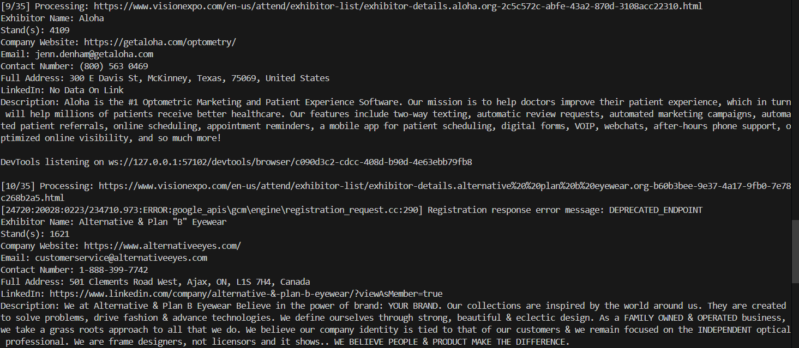

# Exhibitor Data Web Scraper (Python)

"Automated multi-page web scraping using Python to extract exhibitor data into a structured dataset"

This project demonstrates an automated web scraping solution built using Python to extract exhibitor information from publicly available listing pages. The script navigates through multiple pages, collects company-level details, and converts them into a structured dataset for analysis.

---

## 📊 Output Preview

---

## 🧩 Problem

Manually collecting exhibitor details such as company name, website, contact information, and descriptions from multiple web pages is time-consuming and inefficient. It also increases the chances of missing or inconsistent data.

---

## 💡 Solution

Developed a Python-based web scraping script that automates the extraction of exhibitor data from multi-page listings. The script processes each exhibitor page, extracts relevant details, and compiles them into a clean and structured dataset.

---

## 🛠️ Tools & Technologies

* Python
* Requests / Selenium
* BeautifulSoup
* Pandas
* VS Code

---

## ⚙️ Process

* Automated navigation across multiple exhibitor pages
* Extracted key fields such as name, website, email, contact number, and description
* Handled missing or unavailable data
* Structured the extracted data into a tabular format
* Exported final dataset into CSV format

---

## 🧮 Key Features

* Multi-page scraping automation
* Structured data extraction
* Error handling for missing values
* Scalable and reusable scraping logic

---

## 📈 Output

* Generated dataset with 500+ exhibitor records
* Clean and analysis-ready data format
* Extracted multiple data points per exhibitor

---

## 📌 Business Impact

* Automated data collection process
* Reduced manual effort significantly
* Enabled faster data availability for analysis
* Can be reused for similar event or directory-based websites

---

⚠️ Note: This project demonstrates web scraping techniques using publicly accessible data. The dataset provided is a sample and not the complete scraped data to respect data usage policies.
